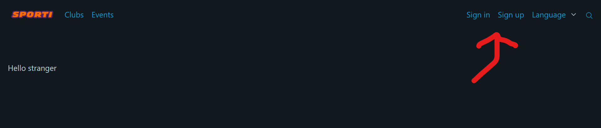
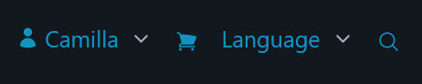
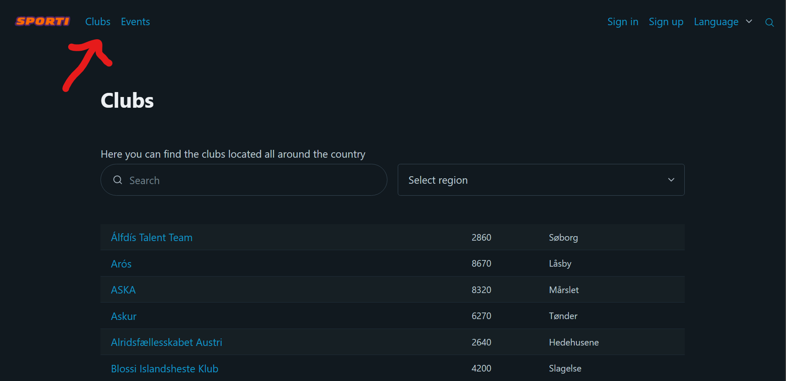
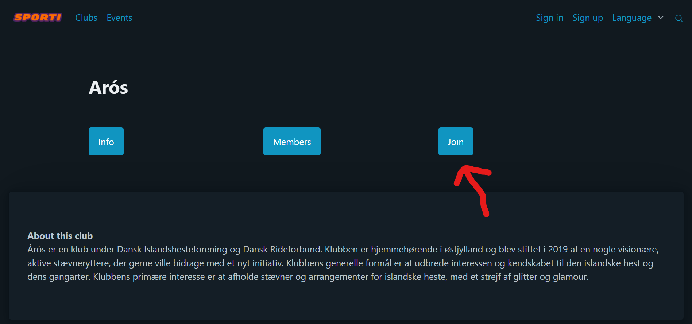
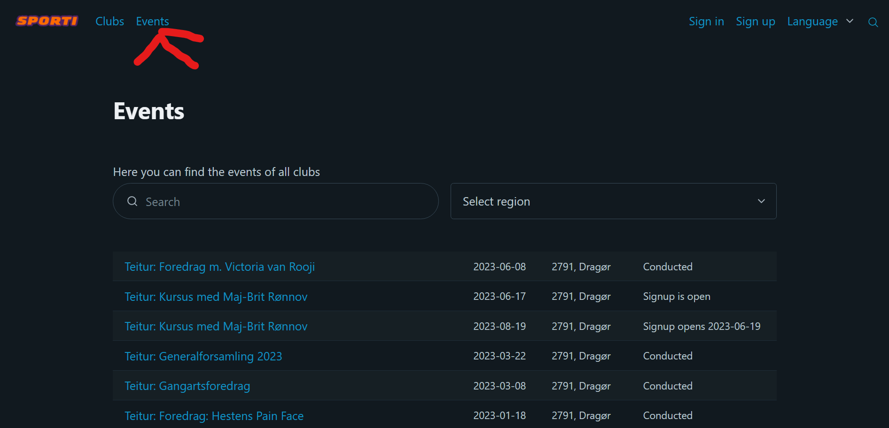
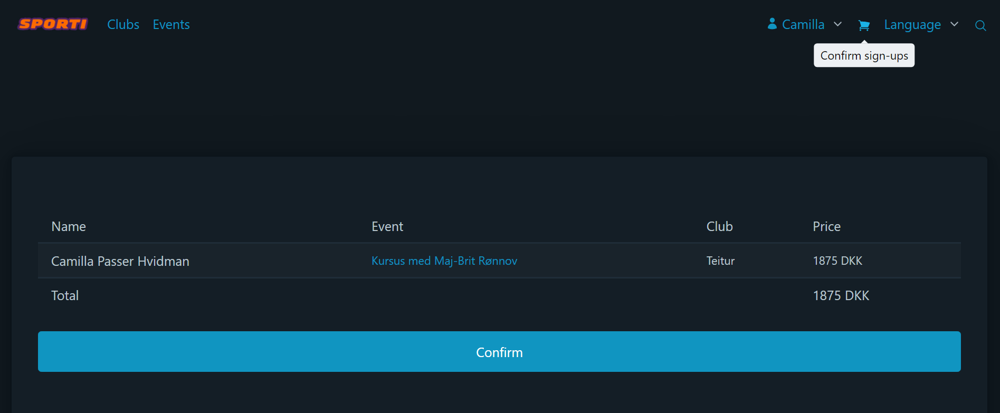
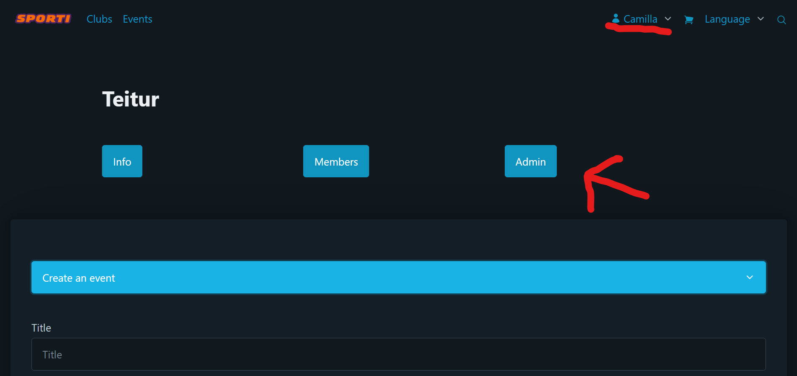

# How to interact with the website

## Getting started

Some of the functionality of this site, does not require the visitor to login. However, to get the full picture, you are able to create your own user, or use one of the already available ones.
To either log in or create a new user, click the corresponding option in the nav-bar of the site

## Users/members

If the setup was run succesfully, the database should be initialized with three users:

- camillapasser@gmail.com,
- sofie@andersen.dk, and
- admin@test.dk

The email-address of the users/members are used as login username, each user has the incredibly secure password: '123'.

##### Rights

The first user is administrator for the club 'Teitur'.
The second user is a regular member of the club 'Hrimnir Vestskoven'.
The third user is a global_admin.

Users (due to right-issues called members) can sign up for events created for the club of which they are a member.

Administrators of a club can in the current version access the admin-page of a club, and from here they are able to create events for that club.

Global_admins are supposed to be able to see and do everything.

##### Signed in

Once the user is signed in, the navbar will change to show the users first-name as a dropdown for the user-page, where you can see information about your profile (not yet implemented), a list of all events that you have signed up for (and confirmed) and clubs that you are a member (or admininistrator) of.
The basket-icon is where you confirm events that you wish to sign up for (more about that in the section for [confirming event-signups](#confirm-event-signup))

Unfortunately it is not yet possible to select language (the dropdown doesn't yet have a function), but you can enjoy the images of the flags. The global search-function has also yet to be implemented, and as for the current version, the icon is just for decoration....

## Clubs

A member is able to sign up for multiple clubs, which they will need to do in order to sign up for events belonging to that club.
To find a club you wish to join, use the overview of all clubs, and click on the name to visit the club-page

You can use the search function to locate certain clubs, or the region selector to find clubs by region.
You join a club, by pressing 'Join' on the club-page

##### Content

The club-page contains information about the club itself, a public list of its members and contact information for the club. If the club has a website url, it is also possible to visit the homepage for the club by pressing this url (will open in a new browser-tab (does require internet-access)).

## Events

A list of all events already created, can be found by visiting the event-overview

Also on this overview is a search function you can use to narrow the (limited) amount of created events
To join an event, click the title to go to the event-page, and use the button to sign up (The button will only be shown if the user is logged in, and the period for sign up is open.)

##### Confirm event signup

It isn't enough to simply press the button to sign up for the event. To simulate a payment-system, the user needs to confirm the signups, by visiting the menu for this (basket-icon). This will display a list of events that you have signed up for, but not yet confirmed (if any), and the total price of all events on the list.

After confirming the signup, the user is now fully signed up, and the event will be displayed on the user profile in the list of events signed up for.

##### Create new event as admin

As an administrator of a club, you have the option to create new events by visiting the admin-page of the club

Open the option to **Create an event**, and fill out the details of the form. Finalize by clicking **Create event**.

Afterwards, the event will be listed under the club events, and in the event-overview.
